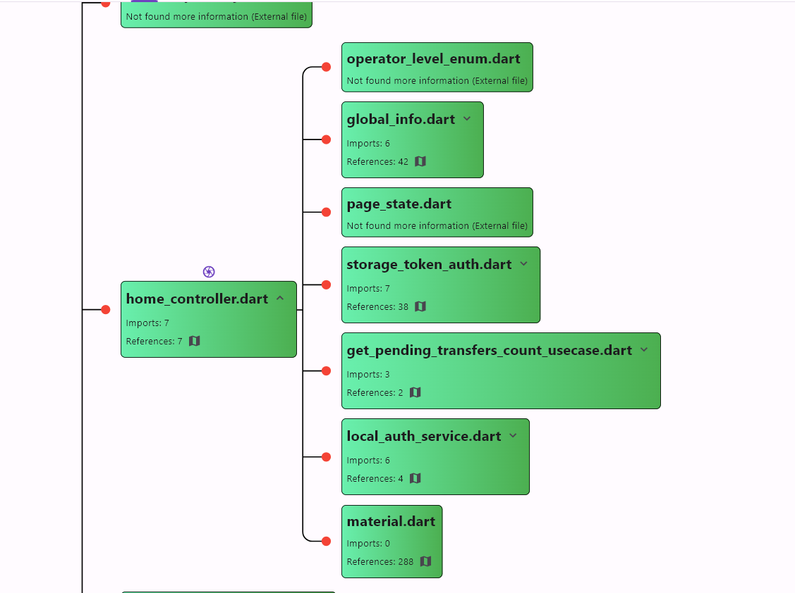
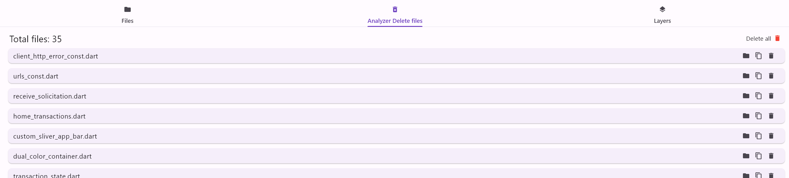
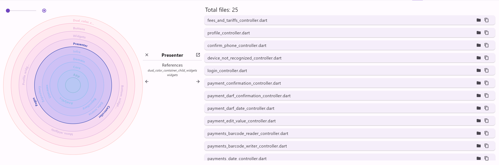

# DeepTrack

DeepTrack is a software developed to analyze projects based on the interactions between files and layers, providing valuable insights into dependencies and organization. It helps developers and teams understand how the components of a project are interconnected, identifying cross-references and import flows.

## Features

### CLI (Command Line Interface)
DeepTrack offers a powerful command-line interface that allows you to:

- Analyze the project by specifying the code path.
- Return data on interactions between files and layers in JSON format, with information about:
  - Which files depend on others.
  - Where the files are referenced.
  - Which layers depend on others.

This approach is ideal for integration with scripts and automation processes, a good example being the validation of architecture implementations during PR time.

#### Available Commands

- **`files`**: Returns a detailed analysis of files, including import and export dependencies.
  ```bash
  deeptrack-cli files --path /path/to/your/project
  ```

- **`layers`**: Analyzes the project's layers, returning the interactions between them.
  ```bash
  deeptrack-cli layers --path /path/to/your/project
  ```

- **`files-and-layers`**: Performs a combined analysis of files and layers, returning both results in JSON format.
  ```bash
  deeptrack-cli files-and-layers --path /path/to/your/project
  ```

- **Common Options:**
  - `--import-regex`: Defines the pattern for importing dependencies.
  - `--export-regex`: Defines the pattern for exporting dependencies.
  - `--file-regex`: Defines the pattern for file names to be analyzed.
  - `--layer-regex`: Defines the pattern for layer validation.

### GUI (Graphical User Interface)
DeepTrack also features an intuitive graphical interface, offering:

- **Mind Map:** Visualization of interactions between files in a mind map format, highlighting connections between them.
   
- **Deletion Suggestion:** Identifies files with no references and suggests they be deleted.
   
- **Import Flow:** A visual representation inspired by Clean Architecture, using circles to show which layers are aware of others. This helps check if the project dependencies are respecting architectural rules.
    

Both the mind map and import flow visualization allow you to capture screenshots for future documentation.

## Objective

The main objective of DeepTrack is to provide a clear and detailed understanding of a project's structure by analyzing its layers and imports. It helps to:

- Detect unwanted dependencies.
- Better organize project components.
- Identify obsolete or unused files.
- Ensure the project adheres to good architectural practices.

## How to Use

### Using the CLI
  [Documentation](cli/deep_track_cli/README.md) for DeepTrack CLI.
  
  <a href="https://github.com/LucasMatheusDev/DeepTrack/raw/refs/heads/main/cli/deep_track_cli/bin/deep_track_cli.exe"
  download="deep_track_cli.exe">Download the CLI 
  arquivo</a>

### Using the GUI
  [Documentation](gui/deep_track_gui/README.md) for DeepTrack GUI.

## Contribution
Contributions to DeepTrack are welcome! If you find bugs, have suggestions, or wish to collaborate on new features, feel free to open issues or submit pull requests in the official repository.
